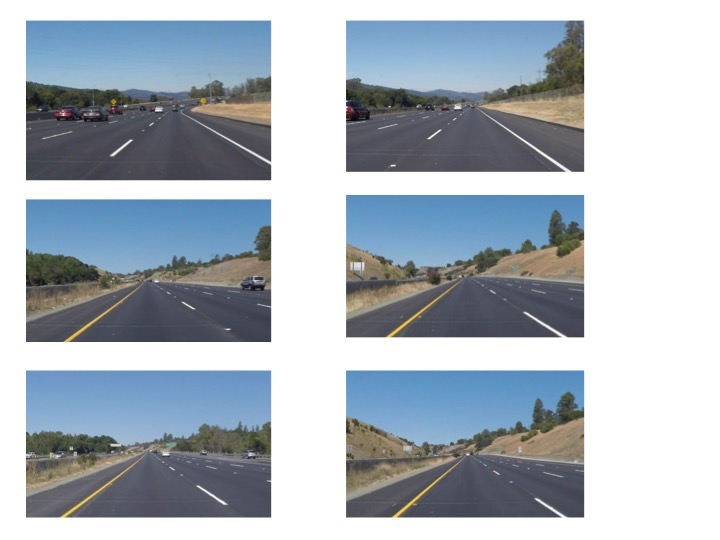
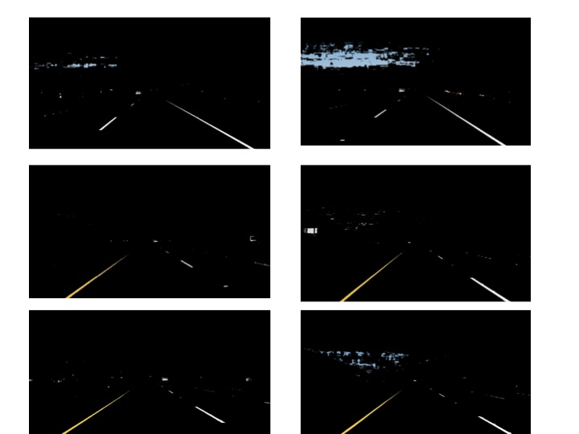
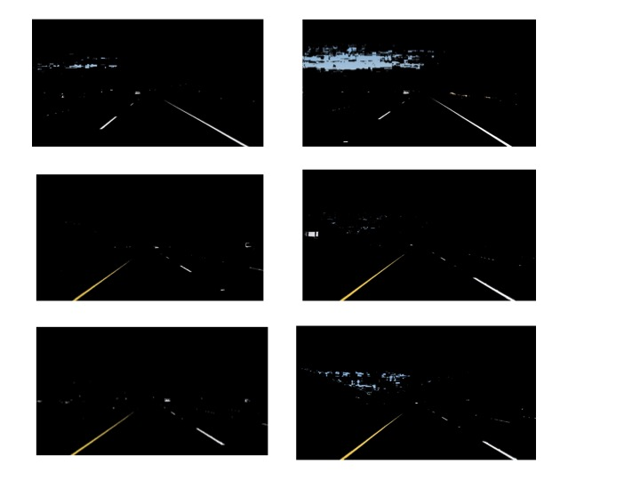
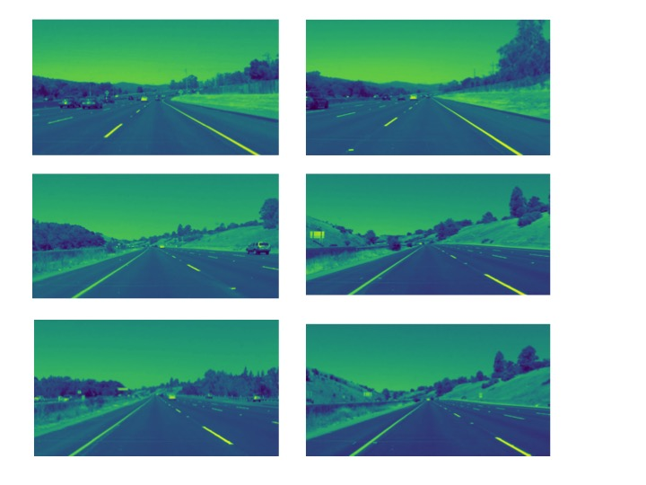
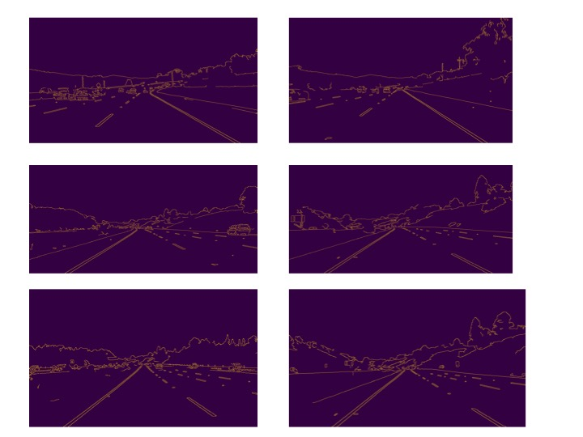
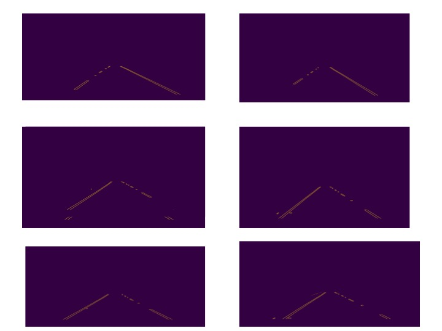
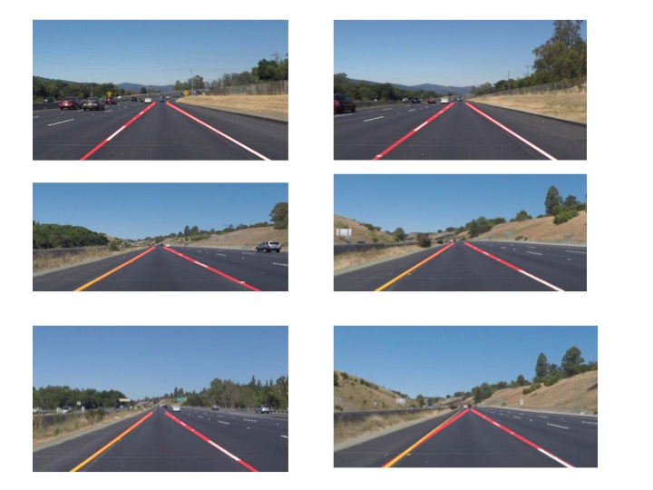

# **Finding Lane Lines on the Road** 

Overview
---

When we drive, we use our eyes to decide where to go.  The lines on the road that show us where the lanes are act as our constant reference for where to steer the vehicle.  Naturally, one of the first things we would like to do in developing a self-driving car is to automatically detect lane lines using an algorithm.

This project  will detect lane lines in images using Python and OpenCV.  OpenCV means "Open-Source Computer Vision", which is a package that has many useful tools for analyzing images.  

1. Describe the pipeline 
--

To test the pipeline, series of test images were provided in test_image directory. Images have lane lines which have  solid white/yellow lines with series of alternating short lines.  The purpose of this project is identify both solid lines and dashed lines as lane lines.

Test Images
--

In our pipeline we perform below operations
1. `Color Selection` :
    We first run color selection on the input image to select only the yellow and white shades of color and mask all other colors. 

2. `GrayScale`: 
    The images should be converted to gray scale detect the edges in a image. 

3. `Image Filtering`: 
    Blurring helps to soften the edges in an image when there is an edge, where the pixel intensity changes rapidly (i.e. from 0 to 255). Filtering done using gaussian blurring.

4. `Edge Detection`: Edges are detected using openCV Canny edge detector.

5. `Region of interest`: As we are interested in finding the lanes , we can select bottom part of the image as region of interest, and mask out the top region like sky,trees. 

6. `Lines Detection`: Connect the edges detected by canny edge detection as lines using openCV Hough.

7. `Extrapolating Lines`:Using above mentioned tools, lanes are recognized but only partially. These recognized partial lanes needs to get extrapolated to full lane line length. This can be achieved by finding the slope and intercept of the lines. As we need to determine both the left lane line and right lane line. We will determine negative slope for left line and positive for right line.

8. `Weighted Image`: Finally draw lines on the original image.

Final Images
--

2. Identify any shortcomings
--
This project had identified lane lines for the given images and videos. But, the limitation of this project is that it is limited to given images/videos. Project should be enhanced to accomidate all the generic conditions in identifying lane lines as it is failing to detect curvature path. 

3. Suggest possible improvements
--
Project can be improved to detect the curvature of the curved roads.

